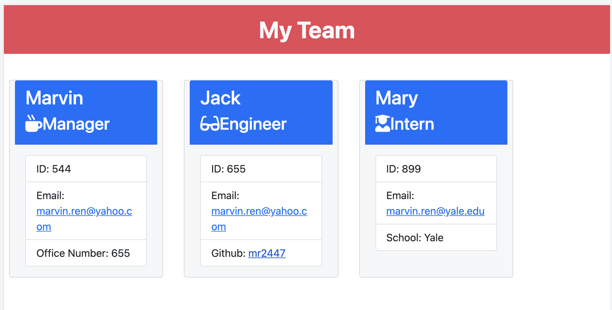

# Team Profile Generator
  ## Badges
  
  
  
  This App is open source software licensed as MIT.
  ## Table of Contents
  * [Description](https://github.com/mr2447/potential-enigma/tree/main/Develop/dist#description)
  * [Installation](https://github.com/mr2447/potential-enigma/tree/main/Develop/dist#installation)
  * [Usage](https://github.com/mr2447/potential-enigma/tree/main/Develop/dist#usage)
  * [Tests](https://github.com/mr2447/potential-enigma/tree/main/Develop/dist#tests)
  * [Credits](https://github.com/mr2447/potential-enigma/tree/main/Develop/dist#Credits)
  * [Questions](https://github.com/mr2447/potential-enigma/tree/main/Develop/dist#questions)
  ## Description: 
  For Managers to generate a webpage that displays his/hers' team basic info So that their emails and Github profiles can be quickly accessed.
  ## Installation: 
  npm install inquirer
  ## Usage
  * 
  * 

https://user-images.githubusercontent.com/87793335/137667138-2bbfae21-949b-4603-9c2b-7b46f3313ced.mp4

  ## Credits 
  Marvin Ren https://github.com/mr2447/team-profile-generator
  ## Tests
  No tests
  ## Quesions?
  Reach me on gitHub or by email. 
  GitHub: mr2447
  Email: marvin.ren@yahoo.com
